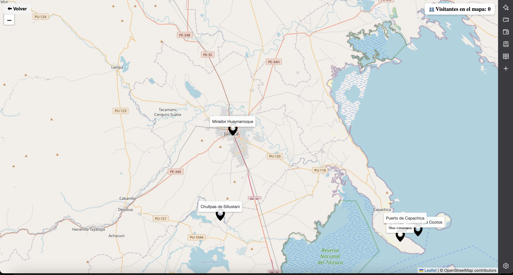
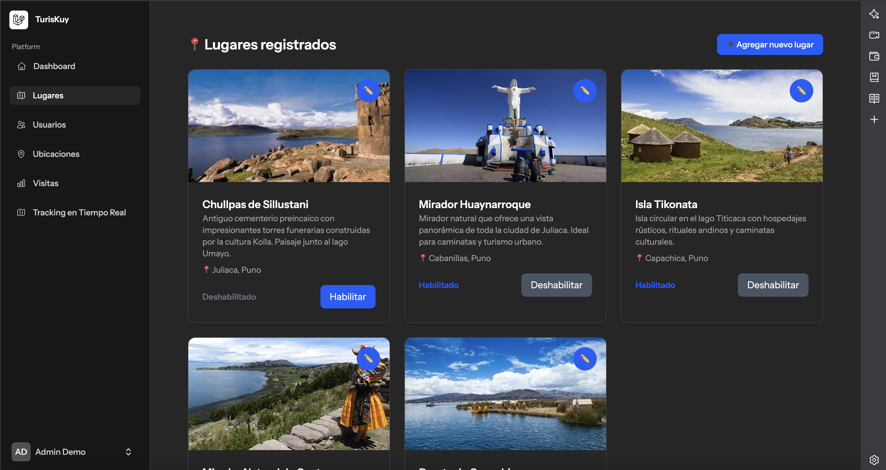
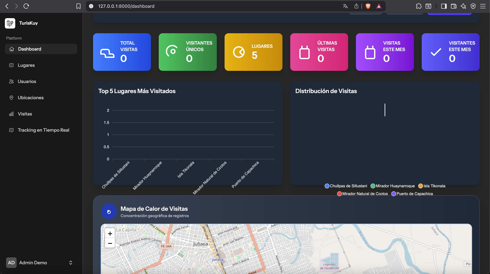

¡Excelente! 🙌 Te dejo un **README.md completo y listo para usar** en tu repositorio de GitHub. Lo hice con estilo profesional y en español, resaltando tu proyecto **TurisKuy**:

````markdown
# 🌍 TurisKuy – Turismo inteligente y sostenible en Capachica

TurisKuy es una plataforma web desarrollada en **Laravel** que promueve el turismo inteligente y sostenible en el distrito de **Capachica, Puno – Perú**.  
Permite a los visitantes visualizar atractivos turísticos mediante geolocalización en tiempo real, mientras que los administradores cuentan con un panel para gestionar lugares, usuarios y visitas.

---

## 🚀 Características principales

- 📍 **Geolocalización** de atractivos turísticos en tiempo real.  
- 🗺️ **Mapa interactivo** con ubicación de visitantes.  
- 🏞️ **Gestión de lugares turísticos** (registro, habilitar/deshabilitar).  
- 👥 **Administración de usuarios y visitas**.  
- 📊 **Dashboard con estadísticas** y mapas de calor.  
- 🎨 **Diseño moderno e intuitivo** con experiencia responsiva.

---

## 📸 Vista previa

### Página principal


### Mapa de geolocalización


### Panel de administración – Lugares registrados


### Dashboard de visitas y estadísticas


---

## 🛠️ Instalación y configuración

1. Clona este repositorio:
   ```bash
   git clone https://github.com/GaryFernandoYM/turisKuy-capachicav1.git
````

2. Accede al proyecto:

   ```bash
   cd turisKuy-capachicav1
   ```
3. Instala las dependencias de Laravel:

   ```bash
   composer install
   npm install && npm run dev
   ```
4. Configura el archivo **.env** con tu base de datos y credenciales:

   ```bash
   cp .env.example .env
   php artisan key:generate
   ```
5. Ejecuta las migraciones y seeders:

   ```bash
   php artisan migrate --seed
   ```
6. Inicia el servidor local:

   ```bash
   php artisan serve
   ```

---

## 🧑‍💻 Tecnologías utilizadas

* [Laravel 10](https://laravel.com/) – Framework backend
* [Leaflet](https://leafletjs.com/) – Mapas interactivos
* [MySQL](https://www.mysql.com/) – Base de datos
* [TailwindCSS](https://tailwindcss.com/) – Estilos y UI moderna
* [JavaScript ES6](https://developer.mozilla.org/es/docs/Web/JavaScript) – Funcionalidad dinámica

---

## 📌 Próximas mejoras

* Implementación de autenticación con OAuth (Google/Facebook).
* Integración con APIs de turismo y clima.
* Módulo de comentarios y calificaciones de lugares.
* Soporte multilenguaje (español/inglés).

---

## 📄 Licencia

Este proyecto está bajo la licencia **MIT** – puedes usarlo, modificarlo y distribuirlo libremente.

---

💡 Desarrollado con ❤️ por **Gary Fernando Yunganina Mamani**

```

---

👉 Con esto, tu README ya se ve **profesional y completo** (descripción, instalación, tecnologías, capturas, licencia).  

¿Quieres que también te prepare la **versión en inglés** para que tu GitHub sea bilingüe y más atractivo para colaboradores externos?
```
